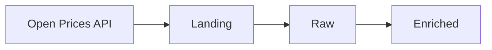

# Exercise 01 — API Ingestion

## Objective

Design and implement an ingestion process from the **Open Prices API** up to the **Enriched** layer.

The expected data flow is:

## Source

Open Prices is part of the Open Food Facts ecosystem and provides product price observations and related data.

API documentation:

https://prices.openfoodfacts.org/api/docs

## Initial Scope

The following endpoints are suggested as a starting point:

* `/api/v1/prices` — product price observations
* `/api/v1/locations` — physical and online locations
* `/api/v1/proofs` — evidence associated with price observations

The scope can be adjusted if needed based on the API characteristics and constraints.

## Requirements

* Ingest data from the selected Open Prices API endpoints.
* Process the data through the **Landing**, **Raw**, and **Enriched** layers.
* Take into account the constraints imposed by the source API.
* Document any assumptions made as part of the proposed solution.

## Deliverables

1. A technical design describing the proposed solution and the reasoning behind the main decisions.
2. A working implementation.
3. Data available in the Raw and Enriched layers.
