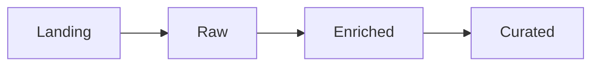
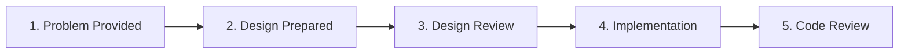

# Data Engineering Mentorship Program

## Goal

Develop a stronger and more structured approach to solving data engineering problems, from understanding a problem to designing and implementing a solution.

The focus will be on:

* Reasoning
* Architectural decisions
* Trade-offs
* Implementation quality
* Clear communication

---

## Scope

The mentorship will cover the full process from problem definition to implementation.

This includes:

* Requirements analysis
* Assumptions
* Architectural thinking
* Design decisions
* Alternatives and trade-offs
* Code implementation

Code will also be evaluated, with particular attention to:

* Readability
* Modularity
* Maintainability
* Reusability
* Scalability

---

## Working Principles

### Reasoning over answers

> [!NOTE]
> There is usually no single correct solution.

The focus is on understanding and explaining the reasoning behind decisions rather than matching a predefined answer.

### Explicit assumptions

> [!TIP]
> Missing information can be replaced with reasonable assumptions, as long as they are clearly documented.

Part of the exercise is identifying what information is missing and understanding how those assumptions affect the proposed solution.

### Shared architecture

Exercises will assume the following medallion architecture:

Each layer should have a clear responsibility, and design decisions should consider how data moves and evolves across the platform.

### Built beyond the exercise

> [!IMPORTANT]
> Implementations should be designed as if they could eventually support more sources, entities, use cases, and larger data volumes.

Solutions should be reusable and scalable rather than solving only the immediate exercise.

---

## Tools

The following technologies and tools will be explored during the program:

* **Databricks Free Edition**
* **PySpark**
* **SQL**
* **GitHub**
* **Markdown**

We will explore whether Databricks Free Edition can support the exercises and integrate effectively with the GitHub repository.

PySpark and SQL will be the main implementation technologies.

Documentation and technical designs will primarily be stored as Markdown files in the repository. Other tools may also be explored when useful.

---

## Exercise Process

Each exercise will follow a similar process:

### 1. Problem provided

A data engineering problem is introduced together with the available context, requirements, and constraints.

### 2. Design prepared

Time is provided to analyse the problem, identify missing information, document assumptions, and prepare a proposed solution.

The design should consider alternatives and explain the reasoning behind the selected approach.

### 3. Design review

The proposed design and reasoning are presented and discussed.

During the review, assumptions, architectural decisions, alternatives, edge cases, and trade-offs may be challenged.

Feedback is provided before moving into implementation.

### 4. Solution implemented

The agreed design is translated into a working implementation.

The implementation should consider not only correctness, but also maintainability, reusability, scalability, and clarity.

### 5. Code reviewed

The implementation is reviewed afterwards.

Feedback may cover areas such as:

* Code structure
* Readability
* Modularity
* Error handling
* Reusability
* Performance
* Scalability
* Testing

An additional session may be scheduled when a deeper code review discussion would be useful.

---

## Expected Deliverables

Each exercise should result in two main deliverables.

### Design

A documented technical design explaining:

* Requirements
* Assumptions
* Proposed architecture
* Key design decisions
* Alternatives considered
* Trade-offs
* Potential risks or limitations

Depending on the exercise, the design may also include diagrams, data flows, data models, or other supporting documentation.

### Implementation

A working implementation of the proposed solution.

The code should aim to be:

* Readable
* Modular
* Maintainable
* Reusable
* Scalable

> [!NOTE]
> The final implementation is important, but the reasoning and engineering decisions that lead to it are equally important.
