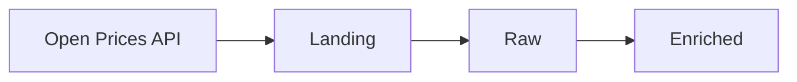

# Exercise 01 — API Ingestion

## Objective

Design and implement an ingestion process from the **Open Prices API** up to the **Enriched** layer.

The expected data flow is:

## Source

Open Prices is part of the Open Food Facts ecosystem and provides product price observations and related data.

API documentation:

https://prices.openfoodfacts.org/api/docs

## Initial Scope

The following endpoints are suggested as a starting point:

* `/api/v1/prices` — product price observations
* `/api/v1/locations` — physical and online locations
* `/api/v1/proofs` — evidence associated with price observations

This scope can be challenged or adjusted if there is a clear reason based on the characteristics or constraints of the source.

## Requirements

* Ingest data from the selected Open Prices API endpoints.
* Process the data through the Landing, Raw, and Enriched layers.
* Investigate the source API and take its characteristics and constraints into account when designing the solution and defining the extraction scope.
* Make reasonable assumptions where requirements are not explicitly defined, and document them.
* Design the solution with reusability and scalability in mind.

## Deliverables

### Design Review

Prepare a technical design describing the proposed solution, assumptions, and reasoning behind the main decisions.

The design will be reviewed and discussed before moving to the implementation phase.

### Implementation

After the design review:

1. Implement the proposed solution.
2. Make the ingested data available in the Raw and Enriched layers.
3. Update the technical design if relevant decisions change during implementation.
